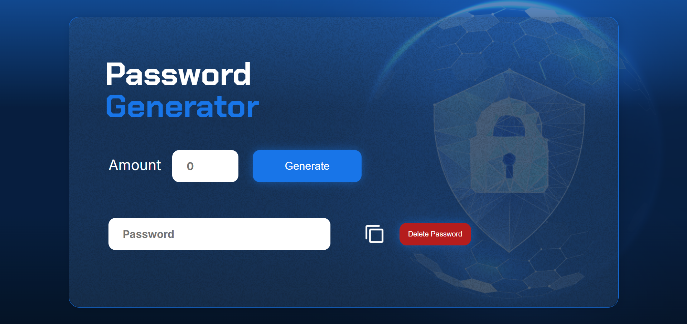
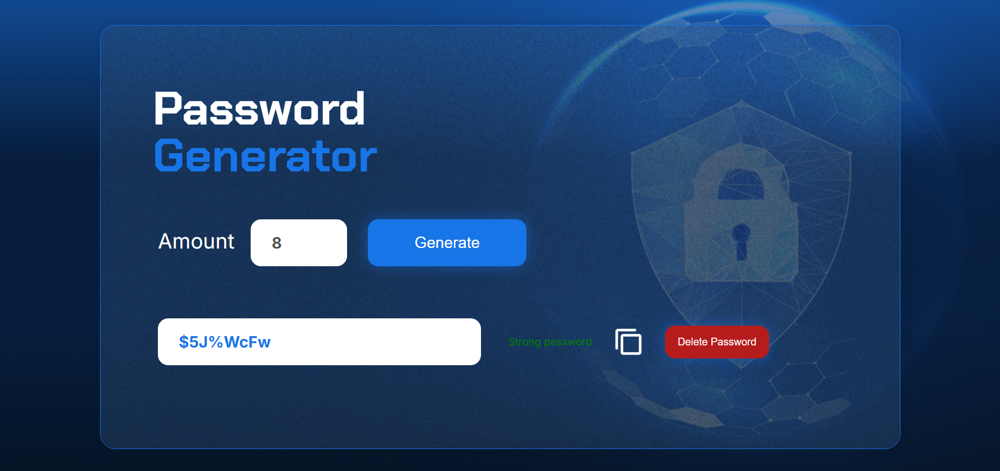

# Password Generator 🔐

This is a password generator with security validation, which shows the strength of the generated password (weak, medium or strong) and allows you to copy the password to the clipboard.

## Demo 🚀

- **[Deploy in Vercel](https://password-generator-alura.vercel.app/)**

### Screenshots

  
  

## Requirements ✅

- **[Node.js](https://nodejs.org/) (v14 or higher recommended)**
- **[npm](https://www.npmjs.com/) (Node.js package manager)**

## Installation 👨‍💻

1. Clone this repository or download the files.

  ```bash
    git clone https://github.com/Dacardonac/password-generator-alura.git
  ```

2. Navega a la carpeta del proyecto en tu terminal.

  ```bash
    cd password-generator
  ```

3. Install the necessary dependencies.
  ```bash
    npm install
  ```

4. Execute the Project.

  Once the dependencies are installed, you can start the local development server with the following command:

  ```bash
    npm run dev
  ```
  This will open the project in your browser. Typically it runs at `http://localhost:3000`.

## Features 📄

- Generation of random passwords of different lengths.

- Validation of password strength (weak, medium or strong).

- Option to copy generated password to clipboard.

- Using SweetAlert2 to display alerts.

## Contributions 👥

**If you would like to contribute to this project, please open a pull request or issue.**

## License

This project is licensed under the MIT License. See the [LICENSE](./LICENSE) file for details.